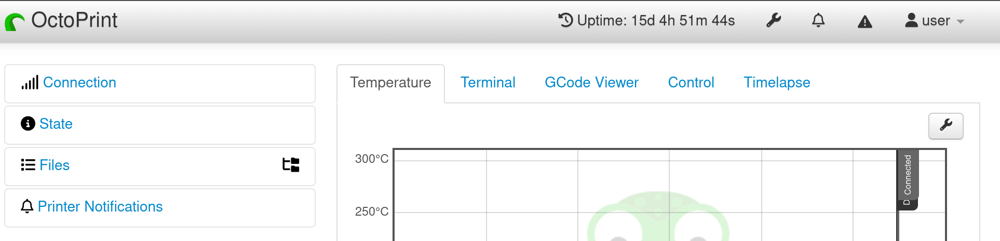
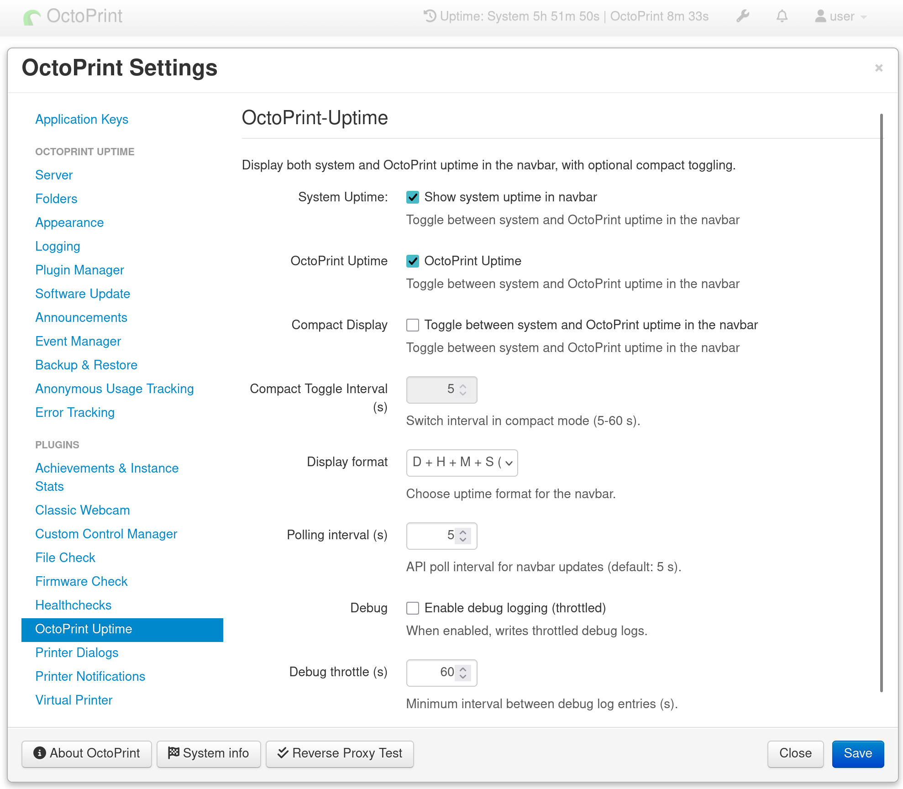

<!-- markdownlint-disable MD041 MD033 -->
<p align="center">
  
</p>
<h1 align="center">OctoPrint‑Uptime</h1>
<!-- markdownlint-enable MD041 MD033 -->

[](https://github.com/Ajimaru/ajitroids#-license)
[](https://python.org)

[](https://octoprint.org)
[](https://github.com/Ajimaru/OctoPrint-Uptime/releases/latest)


[](https://github.com/Ajimaru/OctoPrint-Uptime/pulls)


---

### Effortlessly track your OctoPrint server's uptime, right from your navbar

<!-- markdownlint-disable MD033-->
<strong>
  Lightweight OctoPrint plugin that displays the host system uptime in the navbar and exposes a small JSON API for tooling and integrations.<br />
</strong>
</br />

<!-- markdownlint-enable MD033-->

## Highlights

- 🖥️ Navbar widget with configurable display formats (full / dhm / dh / d)
- 🔒 Small read‑only API at `/api/plugin/octoprint_uptime` (OctoPrint auth enforced)
- ⚙️ Configurable polling interval

## Installation

### Via Plugin Manager (Recommended)

1. Open OctoPrint web interface
2. Navigate to **Settings** → **Plugin Manager**
3. Click **Get More...**
4. Click **Install from URL** and enter:
   `github.com/Ajimaru/OctoPrint-Uptime/releases/latest/download/OctoPrint-Uptime-latest.zip`
5. Click **Install**
6. Restart OctoPrint

### Manual Installation

<!-- markdownlint-disable MD033 -->
<details>
<summary>Manual pip install (advanced users)</summary>

```bash
pip install https://github.com/Ajimaru/OctoPrint-Uptime/releases/latest/download/OctoPrint-Uptime-latest.zip
```

The `releases/latest` URL always points to the newest stable release.

</details>
<!-- markdownlint-enable MD033 -->

## How It Works

The navbar widget polls the plugin API and shows a formatted uptime string. The tooltip displays the calculated start datetime (localized).

1. **API endpoint**: `/api/plugin/octoprint_uptime` (requires OctoPrint API key / auth)
2. **Settings**: `Polling interval`, `Display format`, `Show in navbar` (off by default)

Quick curl example:

```bash
curl -s -H "X-Api-Key: $API_KEY" http://localhost:5000/api/plugin/octoprint_uptime | jq
```

## Configuration

Configure the plugin in **Settings** → **OctoPrint Uptime**:

<!-- markdownlint-disable MD033 -->

</br>
<details>
<summary>Settings Defaults</summary>

- `navbar_enabled`: `true` – Show uptime in the OctoPrint navbar
- `display_format`: `full` – Display format for uptime (options: `full`, `dhm`, `dh`, `d`, `short`)
- `poll_interval_seconds`: `5` – Polling interval in seconds (validated and clamped between 1–120)
- `debug_logging`: `false` – Enable debug logging for troubleshooting
- `debug_throttle`: `60` – Throttle debug logs to reduce log spam

</details>
<!-- markdownlint-enable MD033 -->

## FAQ

**Q: The uptime in the navbar is not updating. What can I do?**
A: Ensure that the `Polling interval` setting is set to a reasonable value (default is 5 seconds). Check the browser console for any errors related to the plugin API. Also, verify that the plugin is enabled in the OctoPrint settings.

**Q: How can I change the display format of the uptime?**
A: You can change the display format in the plugin settings under `Display format`. Options include
`full`, `dhm`, `dh`, `d`, and `short`.

**Q: How do I access the uptime API?**
A: The uptime API is available at `/api/plugin/octoprint_uptime`. You need to include your OctoPrint API key in the request headers for authentication.

**Q: Witch OSes are supported?**
A: Linux is tested and supported. Other OSes may work but are not officially supported.

## Contributing

Contributions welcome! Please:

1. Fork the repository
2. Create a feature branch: `git checkout -b wip/my-feature`
3. Write tests for new features
4. Submit a pull request
5. For local development scripts (setup, restart helper, post-commit build hook, performance monitor), see [.development/README.md](.development/README.md).
6. See [CONTRIBUTING.md](CONTRIBUTING.md) for detailed guidelines.
7. Please follow our [Code of Conduct](CODE_OF_CONDUCT.md).

Note: `main` is protected on GitHub, so changes go through PRs.

[](https://github.com/Ajimaru/OctoPrint-Uptime/issues?q=is%3Aissue%20state%3Aopen)
[](https://github.com/Ajimaru/OctoPrint-Uptime/issues?q=is%3Aissue%20state%3Aclosed)
[](https://github.com/Ajimaru/OctoPrint-Uptime/pulls?q=is%3Apr+is%3Aopen)
[](https://github.com/Ajimaru/OctoPrint-Uptime/pulls?q=is%3Apr+is%3Aclosed)

[](https://pre-commit.com/)


[](https://codecov.io/gh/Ajimaru/OctoPrint-Uptime)
[](https://github.com/Ajimaru/OctoPrint-Uptime/actions/workflows/ci.yml?query=branch%3Amain)
[](https://github.com/Ajimaru/OctoPrint-Uptime/actions/workflows/i18n.yml?query=branch%3Amain)


[](https://github.com/psf/black)
[](https://github.com/prettier/prettier)


## License

AGPLv3 - See [LICENSE](LICENSE) for details.

## Support

- 🐛 **Bug Reports**: [GitHub Issues](https://github.com/Ajimaru/OctoPrint-Uptime/issues)
- 💬 **Discussion**: [GitHub Discussions](https://github.com/Ajimaru/OctoPrint-Uptime/discussions)

Note: For logs and troubleshooting, enable "debug logging" in the plugin settings.

## Credits

- **Original Request**: [Issue 4355](https://github.com/OctoPrint/OctoPrint/issues/4355) by [@Oxize](https://github.com/Oxize) (2021)
- **Development**: Built following [OctoPrint Plugin Guidelines](https://docs.octoprint.org/en/main/plugins/index.html)
- **Contributors**: See [AUTHORS.md](AUTHORS.md)

---

**Like this plugin?** ⭐ Star the repo and share it with the OctoPrint community!
