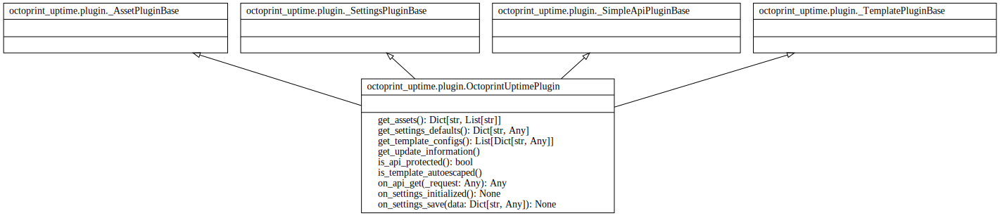

# Architecture — Overview

This page gives a concise overview of the main components of the OctoPrint-Uptime plugin and links to more detailed architecture pages.

Components

- Backend: A small Python module that exposes a plugin API endpoint at `/api/plugin/octoprint_uptime` and helper functions for formatting uptime values.
- Frontend: A Knockout.js ViewModel that queries the plugin API periodically and updates the navbar and About → System dialog UI.
- Settings: Plugin settings control polling interval, whether the navbar widget is enabled, and display format.
- Internationalization: Translatable strings provided via `translations/` and compiled with `pybabel`.

Quick links

- Data flow: see `data-flow.md`
- Algorithms & formatting: see `algorithms.md`
- Settings reference: see `settings.md`
- OctoPrint integration: see `octoprint-integration.md`

Class diagram

The class/interaction diagrams used in the docs are available below — open the detailed or packages views for more context.

- Compact class diagram: [classes.svg](../reference/diagrams/classes.svg)

- Detailed class diagram (includes private/protected members): [classes_detailed.svg](../reference/diagrams/classes_detailed.svg)

- Package/module overview: [packages.svg](../reference/diagrams/packages.svg)

