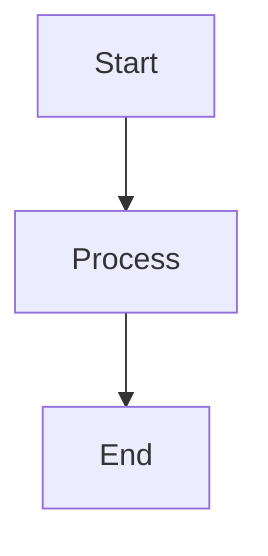

# OctoPrint-Uptime Plugin Documentation

This directory contains the documentation for the [OctoPrint-Uptime](https://github.com/Ajimaru/OctoPrint-Uptime) plugin.

## Overview

OctoPrint-Uptime is a plugin for OctoPrint that displays the system uptime in the About → System dialog and provides an API endpoint for retrieving uptime information. It supports internationalization (English/German), configurable polling intervals, and integration with the OctoPrint frontend.

## Quick Start

### Prerequisites

- OctoPrint 1.12.0+ (Python 3.8+)
- Node.js 20+ (for frontend development)
- mkdocs (for documentation)

### Installation

1. Install the plugin via the OctoPrint Plugin Manager or pip:

   ```bash
   pip install "https://github.com/Ajimaru/OctoPrint-Uptime/archive/main.zip"
   ```

2. Restart OctoPrint.

### Usage

- The system uptime is shown in the About → System dialog and optionally in the navigation bar.
- API endpoint: `/api/plugin/octoprint_uptime`
- Configuration: Settings → Plugin OctoPrint-Uptime

## API Example

```json
{
  "seconds": 3600,
  "uptime": "1 hour",
  "uptime_dhm": "0d 1h 0m",
  "navbar_enabled": true,
  "display_format": "dhm",
  "poll_interval_seconds": 5,
  "uptime_available": true,
  "uptime_note": null
}
```

## Development

### Setup

Install the appropriate requirements for your purpose:

- For development (tests, linters, build tools):

```bash
pip install -r requirements-dev.txt
```

- For building the documentation (mkdocs + docs tooling), create a **separate virtual environment** to avoid dependency conflicts:

```bash
python3 -m venv venv-docs
source venv-docs/bin/activate  # On Windows: venv-docs\Scripts\activate
pip install -r requirements-docs.txt
```

- For runtime/production installs (OctoPrint runtime dependencies), use the top-level `requirements.txt`:

```bash
pip install -r requirements.txt
```

**Important:** Use separate virtual environments for development (`venv`) and documentation (`venv-docs`) to avoid version conflicts, as `requirements-dev.txt` and `requirements-docs.txt` have overlapping dependencies (`pylint`, `ruff`).

Install Node.js dependencies for frontend tooling when needed:

```bash
npm install
```

### Build & Serve

```bash
# Generate JavaScript API docs
./scripts/generate-jsdocs.sh

# Serve locally (with live reload)
mkdocs serve
# Open http://localhost:8000

# Build static site
mkdocs build
# Output in site/
```

## Documentation Structure

```text
docs/
├── README.md                         # Documentation README
├── index.md                          # Overview page (this file)
├── getting-started.md                # Development setup
├── jsdoc.json                        # jsdoc-to-markdown config used by scripts/generate-jsdocs.sh
├── architecture/                     # System design
│   ├── overview.md                   # Architecture overview
│   ├── data-flow.md                  # Data flow diagrams
│   ├── algorithms.md                 # Uptime algorithms
│   ├── settings.md                   # Settings reference
│   └── octoprint-integration.md      # Plugin integration
├── api/                              # API reference
│   ├── python.md                     # Python API (mkdocstrings placeholder + intro)
│   └── javascript.md                 # JavaScript API (generated by scripts/generate-jsdocs.sh)
├── frontend/                         # Frontend docs
│   ├── ui-placements.md              # UI integration
│   └── i18n.md                       # Internationalization
├── development/                      # Developer guides
│   ├── contributing.md               # Contributing guide (synced with top-level CONTRIBUTING.md)
│   ├── testing.md                    # Testing guide (commands, coverage)
│   └── release-process.md            # Release process for maintainers
└── reference/                        # Reference docs
    ├── configuration.md             # Configuration reference
    ├── cli-dev-scripts.md           # Dev scripts reference
    ├── frontend.md                  # Frontend reference
    └── diagrams/
        ├── overview.md              # Conceptual diagram (Mermaid)
        ├── classes.md               # UML class diagram (auto-generated, SVG generated during CI)
        ├── classes_detailed.md      # Detailed UML class diagram (auto-generated, SVG generated during CI)
        ├── packages.md              # Package diagram (auto-generated, SVG generated during CI)
        └── REGENERATE.md            # Instructions to regenerate diagrams locally

Diagrams

- The conceptual Mermaid overview and auto-generated UML diagram markdown files are available in `reference/diagrams/`.
- SVG diagrams are auto-generated during CI/documentation builds (not committed; see `.gitignore`).
- Open `reference/diagrams/overview.md` for the conceptual diagram overview and links to generated diagram markdown files.
```

## Technology Stack

- **[MkDocs](https://www.mkdocs.org/)** - Static site generator
- **[Material for MkDocs](https://squidfunk.github.io/mkdocs-material/)** - Material Design theme
- **[mkdocstrings](https://mkdocstrings.github.io/)** - Python API documentation
- **[jsdoc-to-markdown](https://github.com/jsdoc2md/jsdoc-to-markdown)** - JavaScript API documentation

## Auto-generation

### Python API

Python API documentation is automatically generated from docstrings using mkdocstrings.

To update:

1. Add/update docstrings in Python files
2. Run `mkdocs build`

### JavaScript API

JavaScript API documentation is generated from JSDoc comments during the documentation build.

To update:

1. Add JSDoc comments to JavaScript files
2. Run `./scripts/generate-jsdocs.sh`
3. The script generates `docs/api/javascript.md` (which is generated but not committed; see `.gitignore`)

Example JSDoc comment:

```javascript
/**
 * Fetch uptime information from the OctoPrint-Uptime plugin API.
 *
 * @async
 * @function fetchUptime
 * @param {string} [baseUrl='/'] - OctoPrint base URL (must include protocol when remote)
 * @returns {Promise<{
 *   seconds: number,
 *   uptime: string,
 *   uptime_dhm: string,
 *   navbar_enabled: boolean,
 *   display_format: string,
 *   poll_interval_seconds: number,
 *   uptime_available: boolean,
 *   uptime_note: string|null
 * }|null>} Parsed uptime object or null on error
 */
async function fetchUptime(baseUrl = "/") {
  try {
    const url = new URL("/api/plugin/octoprint_uptime", baseUrl).toString();
    const res = await fetch(url, {
      credentials: "same-origin",
      headers: { Accept: "application/json" },
    });
    if (!res.ok) return null;
    return await res.json();
  } catch (err) {
    console.error("OctoPrint-Uptime: fetchUptime failed", err);
    return null;
  }
}
```

## Deployment

Documentation is automatically deployed to GitHub Pages on push to `main` branch.

Workflow: `.github/workflows/docs.yml`

### Developer guides

The developer-facing pages under `docs/development/` have been synchronized with the repository `CONTRIBUTING.md` and `tests/README.md` and include details on the `scripts/` helper scripts. See the `development` section in the docs for contributor, testing and release guidance.

## Configuration

### mkdocs.yml

Main configuration file for MkDocs:

- Theme settings
- Navigation structure
- Plugin configuration
- Markdown extensions

### jsdoc.json

Configuration for JavaScript documentation:

- Source file patterns
- Output format
- Plugins

## Writing Documentation

### Style Guide

- Use Markdown for all documentation
- Include code examples where appropriate
- Add diagrams using Mermaid for complex flows
- Link between related pages
- Keep language clear and concise

### Markdown Extensions

Available extensions:

- **Admonitions**: `!!! note "Title"`
- **Code blocks**: ` ```python ` with syntax highlighting
- **Tables**: Standard Markdown tables
- **Mermaid diagrams**: ` ```mermaid `
- **Tabbed content**: Custom tabs

### Example: Admonition

```markdown
!!! warning "Important"
This is a warning message.

!!! note
This is a note without a title.
```

### Example: Mermaid Diagram

````markdown

````

### Example: Code Block

````markdown
```python
def example():
    """Example function."""
    return "Hello, World!"
```
````

## Local Development

### Watch Mode

MkDocs automatically rebuilds on file changes:

```bash
mkdocs serve
```

### Build Only

```bash
mkdocs build
```

### Clean Build

```bash
rm -rf site/
mkdocs build
```

## Troubleshooting

### "Module not found" errors

```bash
pip install -r requirements-docs.txt
```

### "npx: command not found"

```bash
npm install
```

### JavaScript docs empty

The JavaScript source files need JSDoc comments. See "Auto-generation" section above.

### Build warnings

Some warnings are expected (e.g., missing type annotations). These don't prevent the build.

### Port already in use

```bash
mkdocs serve -a localhost:8001
```

## Contributing

1. Make changes to documentation files
2. Test locally with `mkdocs serve`
3. Commit and push
4. GitHub Actions will automatically deploy

## Resources

- [MkDocs Documentation](https://www.mkdocs.org/)
- [Material for MkDocs](https://squidfunk.github.io/mkdocs-material/)
- [mkdocstrings Guide](https://mkdocstrings.github.io/)
- [Mermaid Syntax](https://mermaid.js.org/syntax/flowchart.html)

## License

Documentation is part of OctoPrint-Uptime and licensed under AGPLv3.
