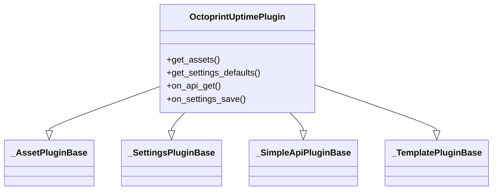

## Conceptual class overview

```mermaid
classDiagram
    class OctoprintUptimePlugin {
      +get_assets()
      +get_settings_defaults()
      +on_api_get()
      +on_settings_save()
    }
    class _AssetPluginBase
    class _SettingsPluginBase
    class _SimpleApiPluginBase
    class _TemplatePluginBase

    OctoprintUptimePlugin --|> _AssetPluginBase
    OctoprintUptimePlugin --|> _SettingsPluginBase
    OctoprintUptimePlugin --|> _SimpleApiPluginBase
    OctoprintUptimePlugin --|> _TemplatePluginBase
```

This lightweight Mermaid diagram complements the autogenerated UML by focusing on the main plugin responsibilities and inheritance relationships.
