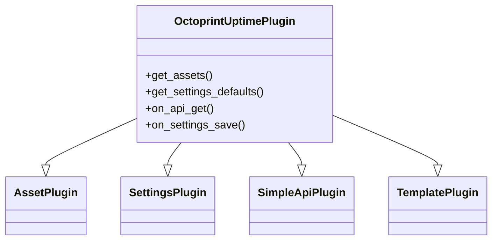

## Conceptual class overview

This lightweight Mermaid diagram complements the autogenerated UML by focusing on the main plugin responsibilities and inheritance relationships.

### Generated diagrams

Below are the markdown files for the automatically generated diagrams:

- **Compact class diagram**: [classes.md](./classes.md) - Auto-generated from source code
- **Detailed class diagram**: [classes_detailed.md](./classes_detailed.md) - Auto-generated from source code
- **Packages diagram**: [packages.md](./packages.md) - Auto-generated from source code

These markdown files contain references to SVG diagrams that are **auto-generated during the CI/documentation build process and not committed to the repository** (see [.gitignore](../../.gitignore)).

To regenerate the diagrams locally, see [REGENERATE.md](./REGENERATE.md).
