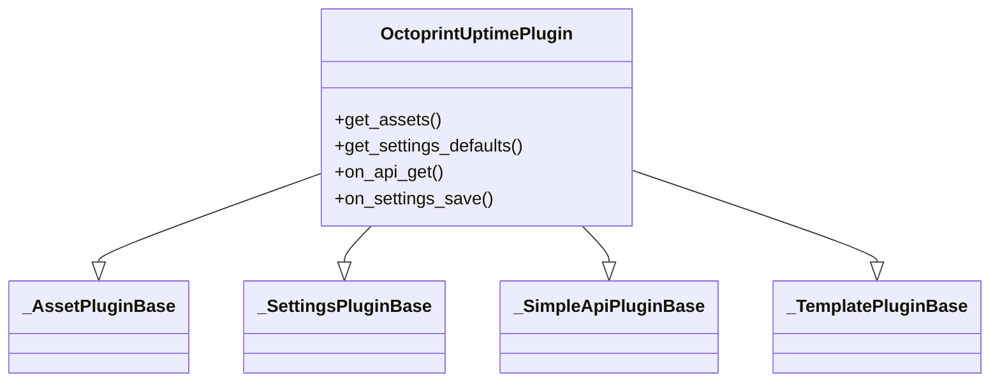

## Conceptual class overview

This lightweight Mermaid diagram complements the autogenerated UML by focusing on the main plugin responsibilities and inheritance relationships.

### Generated diagrams

Below are the automatically generated diagrams (click to open full SVG):

- **Compact class diagram**: [classes.svg](./classes.svg)

  

- **Detailed class diagram**: [classes_detailed.svg](./classes_detailed.svg)

  

- **Packages diagram**: [packages.svg](./packages.svg)

  

If the thumbnails don't render in your editor or preview, open the links above to view the full SVGs.
For full regeneration instructions see [REGENERATE.md](./REGENERATE.md).
